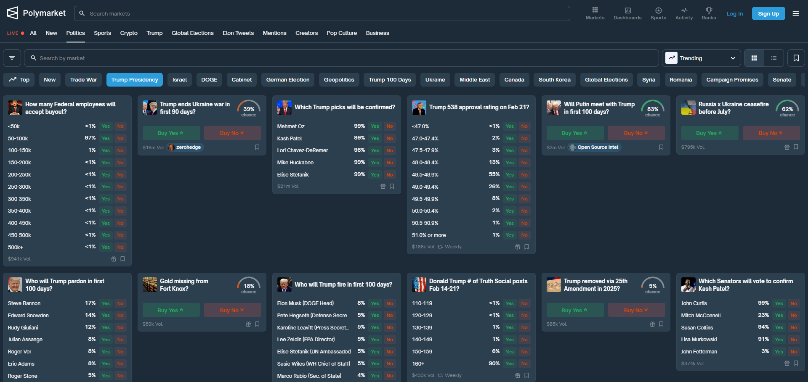
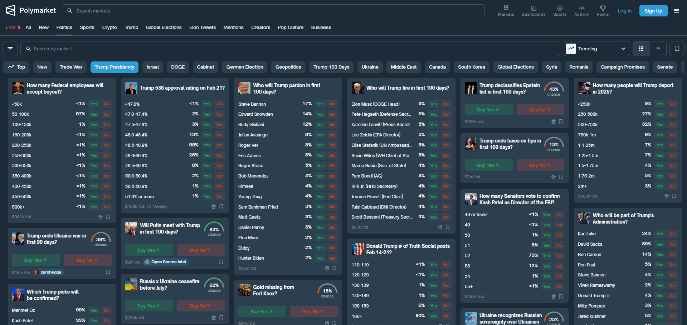

# PolyView & PolyView+

Two lightweight Chrome extensions that improve your Polymarket experience by revealing all bets at a glance.

- **PolyView**  
  Removes height restrictions on Polymarket elements so that all bets are immediately visible.

- **PolyView+**  
  Does everything that PolyView does, and additionally displays events in a clean, masonry-style (waterfall) layout.

---

## Table of Contents

- [Overview](#overview)
- [Features](#features)
- [Installation](#installation)
- [Usage](#usage)
- [Disclaimer](#disclaimer)
- [Contributing](#contributing)
- [License](#license)

---

## Overview

These extensions were built to simplify the Polymarket interface by ensuring that all available betting options are visible without scrolling. Whether you prefer the simpler approach of PolyView or the enhanced layout of PolyView+, you can now see every bet immediately upon loading the page.

*Note: I created these extensions solely for my own convenience while checking odds for events. **No ongoing support or feature updates will be provided.***

---

## Features

### PolyView
- **Removes height restrictions:** All bets on Polymarket are fully visible without the need to scroll.
- **Immediate overview:** Quickly see every available betting option on the page.
- **Shows full title:** Displays the full title of every event without the need to hover over it.




### PolyView+
- **All PolyView features:** Includes all functionality of PolyView.
- **Masonry-style layout:** Events are displayed in a clean, waterfall/masonry-style layout, optimizing the use of screen space.




---

## Installation

### Manual Installation for Chrome

1. **Clone or Download the Repository:**

   ```bash
   git clone https://github.com/Sebastian7700/PolyView.git
   ```

2. **Separate the Extensions:**

   This repository contains two folders:
   - `PolyView`
   - `PolyViewPlus`

   Each folder is a complete Chrome extension.

3. **Load the Extension in Chrome:**

   1. Open Chrome and navigate to `chrome://extensions/`
   2. Enable **Developer mode** (toggle in the top-right corner).
   3. Click on **Load unpacked**.
   4. Select the folder of the extension you wish to install (either `PolyView` or `PolyViewPlus`).

---

## Usage

Once installed:

- Navigate to [Polymarket](https://www.polymarket.com).
- The extension will automatically adjust the layout:
  - **PolyView:** All bets will be fully visible.
  - **PolyView+:** All bets are fully visible, and events are arranged in a masonry-style layout.

If you experience any issues, remember that these extensions are provided **as-is** and no further support or updates will be provided.

---

## Disclaimer

These Chrome extensions are offered as-is without any warranty or guarantee of continued functionality. I built them to help me view all betting options on Polymarket, and while I don't expect them to cause any issues, I cannot guarantee they will always work if Polymarket changes its website. **No support or further feature updates will be provided.**

Use at your own risk.

---

## Contributing

If you would like to fork and improve the code, feel free to submit pull requests. However, please note that I do not plan on actively maintaining these projects.

---

## License

This project is provided under the MIT License. See the [LICENSE](LICENSE) file for details.
